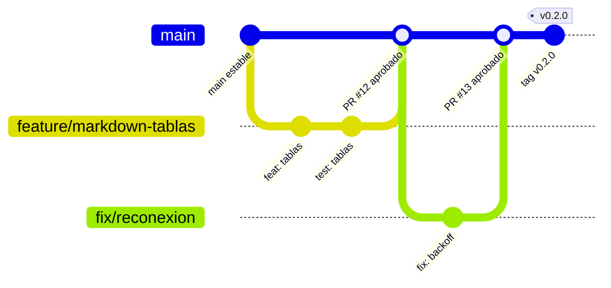

# Guía de contribución

Todos los integrantes del grupo pueden contribuir, **siempre a través de Pull Requests revisados
por el equipo**. Nadie hace push directo a `main`.

> **Equipo actual:** por ahora el proyecto lo desarrolla **una sola persona**
> ([@JuanGualim](https://github.com/JuanGualim)). GitHub no permite aprobar un PR propio, así que
> mientras tanto la regla de `main` exige PR y los checks de CI en verde, con **0 aprobaciones**, y
> cada PR pasa por una **autorrevisión** (ver [Qué revisar en un PR](#qué-revisar-en-un-pr)). Cuando
> se sumen integrantes, se sube a **1 aprobación** y se agregan a `.github/CODEOWNERS`.

## Estrategia de ramas: GitHub Flow



1. **`main` siempre es desplegable.** Cada merge a `main` publica la demo automáticamente (CD).
2. **Crea una rama descriptiva desde `main`** para cada cambio:
   ```bash
   git switch main && git pull
   git switch -c feature/nombre-corto
   ```
   Prefijos: `feature/`, `fix/`, `docs/`, `refactor/`, `test/`, `ci/`, `chore/`.
3. **Haz commits pequeños** con mensajes claros siguiendo
   [Conventional Commits](https://www.conventionalcommits.org/es/):
   `feat: agrega adaptador SSE`, `fix: evita doble envío con Enter`, `docs: ...`, `test: ...`.
4. **Verifica localmente** antes de subir:
   ```bash
   npm run ci
   ```
5. **Abre un Pull Request hacia `main`** lo antes posible (puede ser _draft_) y completa la
   plantilla.
6. **Revisión:** todos los checks de CI deben estar en verde y el PR debe revisarse. Con equipo, se
   necesita **al menos una aprobación** de otro integrante; mientras haya un solo desarrollador,
   el autor hace una autorrevisión en la pestaña _Files changed_ usando la lista de abajo y deja
   un comentario con el resultado. Los comentarios se resuelven con nuevos commits en la misma rama.
7. **Merge** (se recomienda _Squash and merge_) y se borra la rama.
8. **Releases:** para publicar una versión del SDK se crea un tag SemVer desde `main`
   (`git tag v0.2.0 && git push origin v0.2.0`); el pipeline de CD crea el GitHub Release.

## Configuración del repositorio (una sola vez, por quien administre el repo)

En **Settings → Rules → Rulesets → New branch ruleset** (con _Enforcement status: Active_ y
_Target branches: Include default branch_):

- ✅ Require a pull request before merging → **Required approvals: 1** (con un solo desarrollador,
  **0**; si no, nadie podría fusionar)
- ✅ Dismiss stale pull request approvals when new commits are pushed
- ✅ Require review from Code Owners (usa `.github/CODEOWNERS`; solo cuando haya equipo)
- ✅ Require status checks to pass before merging → marcar:
  `Lint, formato y tipos`, `Tests y cobertura (≥ 80%)`, `Build (SDK + demo)`
- ✅ Require branches to be up to date before merging
- ✅ Require conversation resolution before merging
- ✅ Block force pushes y Restrict deletions

En **Settings → Pages** seleccionar **Source: GitHub Actions** para que el workflow de CD pueda
publicar la demo en <https://juangualim.github.io/Proyecto1_IA_selectivo/>.

## Qué revisar en un PR

- ¿El cambio respeta las capas descritas en [`docs/ARQUITECTURA.md`](docs/ARQUITECTURA.md)?
- ¿Tiene tests que fallarían sin el cambio? ¿La cobertura sigue ≥ 80 %?
- ¿Los textos visibles están en español y los componentes son accesibles (roles/labels)?
- ¿Se modificó la API pública (`src/index.ts`)? Si es así, ¿está documentado?

## Estilo de código

El estilo lo impone la herramienta, no la opinión: ESLint + Prettier se ejecutan en CI y un PR
con errores de lint no puede fusionarse. Usa `npm run lint:fix` y `npm run format`.
Consulta [`AGENTS.md`](AGENTS.md) para las convenciones detalladas.
