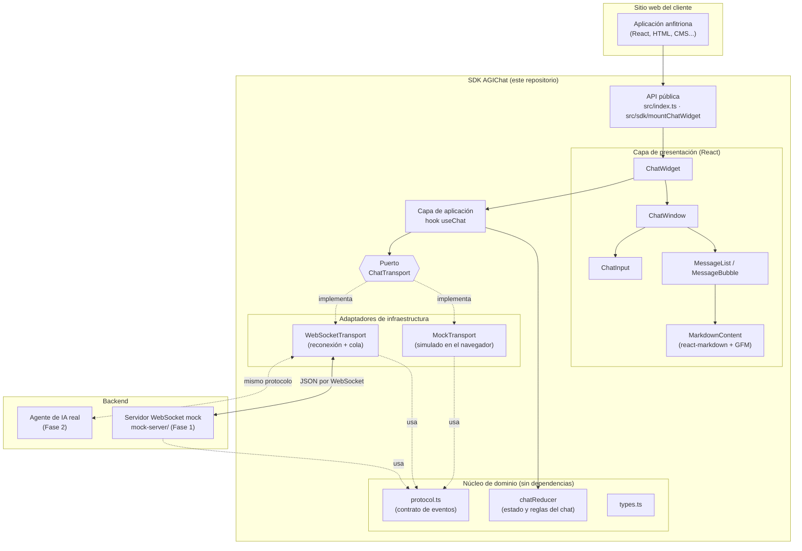
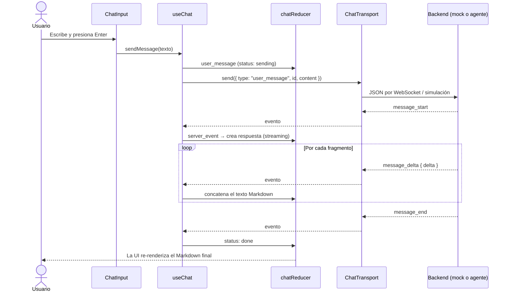
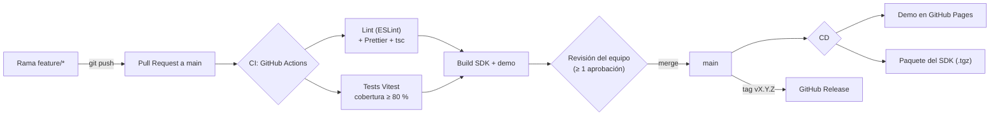

# Arquitectura del SDK de AGIChat

Este documento describe la arquitectura del widget de chat agéntico de AGIChat, la justificación
de las decisiones tomadas y cómo debe crecer la estructura de carpetas a medida que el proyecto
escale (fase 2: conexión con un agente real).

## 1. Visión general

El producto es un **Software Development Kit (SDK)**: un widget de chat que los clientes de
AGIChat incrustan en sus sitios para ofrecer una interfaz agéntica. Se distribuye de tres formas:

| Forma de uso                      | Para quién                         | Artefacto                           |
| --------------------------------- | ---------------------------------- | ----------------------------------- |
| Componente React `<ChatWidget />` | Clientes con apps React            | `dist/lib/agichat-widget.js` (ESM)  |
| Función `mountChatWidget()`       | Clientes con cualquier framework   | `dist/lib/agichat-widget.js` (ESM)  |
| Etiqueta `<script>`               | Sitios estáticos, CMS, sin bundler | `dist/embed/agichat-widget.iife.js` |

## 2. Diagrama de alto nivel



### Flujo de un mensaje



## 3. Arquitectura elegida: Hexagonal (Puertos y Adaptadores)

Se eligió una **arquitectura hexagonal** combinada con un **flujo de datos unidireccional**
(reducer) en el núcleo.

### Capas

1. **Núcleo de dominio (`src/core`)** — tipos, protocolo y `chatReducer`. Son funciones puras en
   TypeScript sin React, sin red y sin DOM. Contienen todas las reglas del chat (qué pasa cuando
   llega un fragmento, cuándo un mensaje falla, cómo se pierde la conexión, etc.).
2. **Puerto (`src/transports/ChatTransport.ts`)** — la interfaz `ChatTransport`, el único punto
   por el que el widget se comunica con el exterior: `connect`, `disconnect`, `send`,
   `subscribe`, `onStatusChange`.
3. **Adaptadores (`src/transports/*`)** — implementaciones concretas del puerto:
   `MockTransport` (simulación en el navegador) y `WebSocketTransport` (backend real).
4. **Aplicación (`src/hooks/useChat.ts`)** — conecta el puerto con el reducer y expone acciones
   (`sendMessage`, `retry`, `clear`) a la UI.
5. **Presentación (`src/components`)** — componentes React "tontos" que solo reciben props.
6. **API pública (`src/index.ts`, `src/sdk`, `src/embed.ts`)** — lo que ven los clientes del SDK.

### Justificación

| Necesidad del proyecto                                                     | Cómo la resuelve la arquitectura                                                                                                                               |
| -------------------------------------------------------------------------- | -------------------------------------------------------------------------------------------------------------------------------------------------------------- |
| **Cambiar el mock por un agente real en la fase 2 sin tocar la interfaz.** | La UI solo depende del puerto `ChatTransport`. Pasar a producción es cambiar `new MockTransport()` por `new WebSocketTransport({ url })` o un adaptador nuevo. |
| **Cobertura de tests ≥ 80 %.**                                             | El núcleo es puro (se prueba sin DOM ni red) y los adaptadores se prueban con dobles (`FakeTransport`, `FakeWebSocket`). Hoy la cobertura es ~99 %.            |
| **Varios desarrolladores contribuyendo en paralelo (PRs).**                | Las capas tienen responsabilidades separadas: se puede trabajar en UI, protocolo o transportes sin conflictos.                                                 |
| **Ser un SDK reutilizable por muchos clientes.**                           | El widget no conoce al backend; cada cliente inyecta su transporte, colores, textos y tema.                                                                    |
| **200 usuarios el día uno / robustez.**                                    | El `WebSocketTransport` tiene reconexión con backoff exponencial y cola de envío; el reducer maneja errores y pérdidas de conexión de forma explícita.         |
| **Respuestas en Markdown.**                                                | El protocolo transporta Markdown en fragmentos (streaming) y `MarkdownContent` lo renderiza de forma segura (sin HTML crudo → sin XSS).                        |

**Alternativas descartadas:**

- _MVC / componentes con `fetch` directo_: acopla la UI al backend; migrar a la fase 2 obligaría a
  reescribir componentes.
- _Librería de estado global (Redux, Zustand)_: innecesaria para un widget autocontenido y
  añadiría peso al bundle de los clientes. `useReducer` ofrece el mismo patrón sin dependencias.
- _Micro-frontends / Web Components puros_: más complejidad sin beneficio en esta etapa; el
  bundle IIFE ya permite usar el widget fuera de React.

### Protocolo (contrato con el backend)

Definido en [`src/core/protocol.ts`](../src/core/protocol.ts). Todo backend (mock o real) debe
hablar este protocolo en JSON:

| Dirección        | Evento          | Campos                                |
| ---------------- | --------------- | ------------------------------------- |
| Widget → Backend | `user_message`  | `id`, `content`                       |
| Backend → Widget | `message_start` | `id` (de la respuesta), `replyTo?`    |
| Backend → Widget | `message_delta` | `id`, `delta` (fragmento de Markdown) |
| Backend → Widget | `message_end`   | `id`                                  |
| Backend → Widget | `error`         | `message`, `id?` (mensaje afectado)   |

Los eventos recibidos se validan con `parseServerEvent`; los inválidos se ignoran.

## 4. Estructura de carpetas

```text
.
├── .github/
│   ├── workflows/
│   │   ├── ci.yml               # Lint, formato, tipos, tests + cobertura, build (en cada PR)
│   │   └── cd.yml               # Deploy de la demo a GitHub Pages + releases del SDK
│   ├── ISSUE_TEMPLATE/          # Plantillas de issues
│   ├── pull_request_template.md # Checklist obligatorio de los PR
│   ├── CODEOWNERS               # Revisores obligatorios
│   └── dependabot.yml
├── demo/                        # App de ejemplo que simula el sitio de un cliente (no es parte del SDK)
├── docs/
│   └── ARQUITECTURA.md          # Este documento
├── mock-server/                 # Servidor WebSocket que simula al agente (Node)
│   ├── createMockServer.ts
│   ├── createMockServer.test.ts
│   └── server.ts                # Punto de entrada: npm run mock-server
├── src/
│   ├── core/                    # DOMINIO: TypeScript puro, sin React ni red
│   │   ├── types.ts             #   Tipos de dominio (ChatMessage, ConnectionStatus)
│   │   ├── protocol.ts          #   Contrato de eventos con el backend + validación
│   │   ├── chatReducer.ts       #   Estado y reglas del chat
│   │   ├── format.ts            #   Utilidades de presentación puras
│   │   └── id.ts
│   ├── transports/              # PUERTO + ADAPTADORES
│   │   ├── ChatTransport.ts     #   Interfaz (puerto) y clase base
│   │   ├── MockTransport.ts     #   Adaptador simulado
│   │   ├── WebSocketTransport.ts#   Adaptador WebSocket
│   │   ├── createTransport.ts   #   Fábrica a partir de configuración
│   │   └── mock/responder.ts    #   Respuestas simuladas (compartido con mock-server)
│   ├── hooks/
│   │   └── useChat.ts           # APLICACIÓN: une transporte + reducer
│   ├── components/              # PRESENTACIÓN: una carpeta por componente
│   │   ├── ChatWidget/          #   Componente raíz (launcher + ventana)
│   │   ├── ChatWindow/
│   │   ├── ChatLauncher/
│   │   ├── MessageList/
│   │   ├── MessageBubble/
│   │   ├── MarkdownContent/
│   │   ├── ChatInput/
│   │   ├── TypingIndicator/
│   │   └── icons/
│   ├── sdk/
│   │   └── mountChatWidget.tsx  # API vanilla (sin React en el cliente)
│   ├── styles/agichat.css       # Estilos con prefijo agichat- y variables CSS
│   ├── test/                    # Utilidades de test (setup, FakeTransport)
│   ├── index.ts                 # API PÚBLICA (ESM)
│   └── embed.ts                 # Entrada del bundle <script> (window.AGIChat)
├── AGENTS.md                    # Guía para herramientas agénticas
├── CONTRIBUTING.md              # GitHub Flow y proceso de PR
├── vite.config.ts               # Demo + configuración de Vitest (umbral 80 %)
└── vite.lib.config.ts           # Build del SDK (ESM e IIFE)
```

### Cómo debe escalar el proyecto

Reglas para mantener la arquitectura a medida que crezca:

1. **Regla de dependencias** (de adentro hacia afuera):
   `core` ← `transports` ← `hooks` ← `components` ← `sdk`/`index.ts`.
   `core` **nunca** importa de React ni de otras capas. Los componentes **nunca** importan un
   adaptador concreto (solo el tipo `ChatTransport`).
2. **Nuevo backend / agente real (fase 2):** crear `src/transports/<Nombre>Transport.ts` que
   extienda `BaseTransport`, su archivo `.test.ts`, registrarlo en `createTransport.ts` y
   exportarlo en `src/transports/index.ts`. Ningún componente debe cambiar.
   Ejemplos previstos: `SseTransport` (Server-Sent Events), `HttpStreamingTransport`.
3. **Nuevos tipos de evento** (p. ej. `tool_call`, `attachment`, `suggestions`): se agregan
   primero a `protocol.ts` (+ validación), luego al `chatReducer` (+ tests) y por último a la UI.
4. **Nuevo componente:** carpeta `src/components/<Nombre>/` con `<Nombre>.tsx` y
   `<Nombre>.test.tsx`. Si crece, puede incluir subcomponentes en la misma carpeta.
5. **Funcionalidades grandes** (historial persistente, autenticación, adjuntos): crear un módulo
   por funcionalidad dentro de la capa correspondiente, p. ej. `src/core/history/`,
   `src/hooks/useHistory.ts`, `src/components/Attachments/`.
6. **API pública:** todo lo que se exporte desde `src/index.ts` es contrato con los clientes.
   Cambiarlo implica una nueva versión mayor (SemVer) y un tag `vX.Y.Z`.
7. **Si el repositorio crece a varios paquetes** (p. ej. SDK de React Native o backend del
   agente), migrar a un monorepo con _npm workspaces_: `packages/core`, `packages/react`,
   `packages/agent-server`, manteniendo `core` compartido.

## 5. Calidad y entrega



- **Estrategia de ramas:** GitHub Flow (ver [`CONTRIBUTING.md`](../CONTRIBUTING.md)).
- **Lint:** ESLint (typescript-eslint + reglas de React Hooks) y Prettier; ambos bloquean el CI.
- **Tests:** Vitest + Testing Library. El umbral de 80 % (líneas, ramas, funciones y
  sentencias) está configurado en `vite.config.ts`: si baja, el CI falla.
- **Seguridad del Markdown:** `react-markdown` no interpreta HTML crudo y sanea URLs
  (`javascript:` se bloquea); los enlaces abren con `rel="noopener noreferrer"`.
